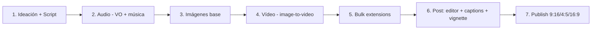

# Santo Grial Visual — Master Playbook PACAME

> *"El cover hace el 80% del trabajo. Reels reach, carousels convert. Retention es la métrica suprema."*
> — Tesis sintetizada del notebook

## TL;DR (10 líneas, accionable)

1. **Genera audio antes que imagen, e imagen antes que vídeo**: el voiceover marca el ritmo, las imágenes garantizan consistencia, el vídeo solo anima.
2. **Nunca prompts en muralla de texto**: usa fórmulas estructuradas (6/8 componentes) o **JSON prompting**.
3. **Modelos canónicos hoy** — imagen: Nano Banana Pro / DALL-E (ChatGPT Image 2.0) / Imagen FX (gratis) / Flux. Vídeo: Veo 3.1 / SeaDance 2.0 / Kling 2.6. Audio: ElevenLabs / Suno / Hume.ai.
4. **Carrusel = 10 slides 4:5 (1080x1350)**, estructura Hook→Setup→Reframe→Value×2→Update→Climax→Save→CTA. Añadir música mete en algoritmo Reels.
5. **Reel/Short = 9:16, hook visual+audio en frame 0** (riser SFX), captions Thrive/Poppins con shadow + glow + fade-in 0.2s, **vignette global**.
6. **Bulk con extensions**: AutoWhisk (imágenes Whisk) + Autoflow (vídeos Veo Flow) + Canva Bulk Create.
7. **Truco lip-sync**: video negro con audio + imagen referencia → SeaDance 2.0 sincroniza labios.
8. **9 anti-patterns** prohibidos: vague prompts, AI loop ("hazlo más natural"), olvidar contexto/marca, prompts manuales para vídeo, diálogo entre comillas, estilos contradictorios, una sola cara para todo el branding, "experiencia personal" sin autoridad, datos sensibles sin opt-out.
9. **Frameworks de prompting**: ASPECT / TAREA / CICLO / ECO / ROSAS (estructura) + COT / TOT / ReAct / Adversarial / Metaprompting (razonamiento) + PAS / Brick-by-Brick / Timeline (contenido).
10. **Deploy autónomo**: Claude Code + Firecrawl (scrape brand) + Vercel MCP + GitHub MCP → `create a GitHub repo, publish it, and create a brand new website on Vercel`.

---

## 1. Modelos canónicos por capa

### 1.1 Imagen

| Modelo | Cuándo usarlo | Highlight |
|---|---|---|
| **Nano Banana / Nano Banana 2 / Nano Banana Pro** | Producto, arquitectura, edición quirúrgica, character refs 360° | Conserva texto en etiquetas, swap ropa/fondo/luz sin alterar sujeto |
| **ChatGPT Image 2.0 (DALL-E)** | Carruseles, mockups, brand assets, logos | Mejor legibilidad de texto del mercado, consistencia entre slides |
| **Flux (1, Context, Snell, 2 Pro)** | B-roll consistente, isolating clothing en capas transparentes, gen local rápida | Pocos pasos, alta realista |
| **Stable Diffusion (SDXL, 1.5)** | ComfyUI con LoRAs, control absoluto, privacidad | Anime, skin ultra-realista, totalmente local |
| **Google Imagen 3/4 + Imagen FX** | Cinematic 3D, B-roll corporativo | **FX gratis sin límite estricto**, múltiples variaciones a la vez |
| **Z-Image Turbo** | Gen ultra-rápida local en hardware modesto | 4-8 pasos, retratos/arquitectura/concept |
| **Qwen Image / Qwen Image Edit** | Edición quirúrgica local, pose extraction | Swap subjects, consistency en escenas de acción |
| **Midjourney** | Concept shots cinematográficos | Frame inicial premium para guiar vídeo |
| **Freepik Spaces** | Bulk lookbooks producto, campañas | "Freepik List" + node workflow → decenas variaciones |
| **Weavy AI** | Photoshoots virtuales fashion | Modular prompting con capas de ropa |
| **Google Whisk** | B-roll abstracto rápido, variaciones desde refs | ~100 attempts/día gratis |
| **SaleADS (sayats.ai)** | E-commerce ads alta conversión | Sube producto → drop en escenarios marketing |
| **Rendair AI / Rayon Design / Synapse.app** | Arquitectura, planos 2D→3D | Renders fotorrealistas desde SketchUp |
| **Claude Design** | UI wireframes, landings | Adhiere brand guidelines uploaded |

### 1.2 Vídeo

| Modelo | Cuándo usarlo | Highlight |
|---|---|---|
| **Google Veo 3 / Veo 3.1 (Fast / Quality)** | Time-lapse, ads $100k tier, audio nativo | Responde a JSON prompts; transformaciones continuas |
| **SeaDance / Seedance (1.0–2.5 Turbo Pro)** | UGC ads, fashion, lip-sync premium | Físicas hiper-realistas, 1080p nativo, multi-angle |
| **Kling / Cling (2.1 Pro – 3.0)** | Walkthroughs arquitectónicos, product reveals 3D | **Start frame → end frame** (interpolación entre 2 imágenes) |
| **Sora 2 / Sora 2 Pro** | Cinematic stylizado premium, B-roll music videos | Aesthetics > realismo |
| **Runway Gen-3 / Gen-4.5** | Outpainting, VFX en post (cambiar objetos/clima) | Edición reality-altering |
| **Hunyuan Video** | Cinematic sin ser experto en prompts | Built-in "director mode" auto-promptea |
| **LTX-2.3 (Lightricks)** | Local 4K + audio simultáneo, sincronía con audio externo | Open-source, motion sigue ritmo del audio |
| **Wan 2.2** | Local, animar single image con físicas (fuego, pelo, lengua) | Open-source |
| **LongCat-Video** | Vídeo coherente largo en ComfyUI | "Overlap" feature stitches frames sin cortes |
| **V-Fabric 1.0 (Viu)** | Talking videos hasta 1 min, subtítulos auto | 60× más barato y 7× más rápido que rivales |
| **Luma Dream Machine, Vidu, Hailuo 2.3** | Alternativas cinematic | Mencionados como fallback |

### 1.3 Audio

| Tipo | Tool | Por qué |
|---|---|---|
| **TTS humano expresivo** | **ElevenLabs** (V3 integrado en Freepik) | Líder de mercado; tags expresivos "ominous", "serious" |
| **TTS emocional** | **Hume.ai** | Entiende y actúa la emoción del script |
| **TTS multilingüe** | Artlist AI Voiceover | Studio-quality, partnerships con voice actors reales |
| **TTS alternativos** | Fish Audio, Google AI Studio | Backup para faceless/long-form |
| **Música original** | **Suno AI** | Copyright-free, instrumental + jingles con lyrics |
| **Música+vídeo a la vez** | Producer AI | Genera music + video desde un prompt |
| **SFX cinematic** | Artlist + CapCut Audio Library | Heartbeats, intense risers, ASMR packaging |
| **Audio nativo del modelo** | Veo 3.1 / SeaDance 2.0 / LTX-2.3 | Generan SFX matched a la física del video |

### 1.4 Trucos de sincronía audio↔vídeo

- **"Black Video" Lip-Sync**: exporta MP4 negro con solo el audio + sube imagen ref → SeaDance 2.0 sincroniza labios y aplica camera movement.
- **Veo 3.1 prompt-driven**: subir imagen + script + instrucción `synchronize the movement of the mouth with this script`.
- **Tools dedicados**: HeyGen, D-ID, Creatify Aurora (interna ElevenLabs).
- **Music-first editing**: elige música ANTES de visuals, corta video al beat.
- **Audio ducking**: bajar SFX nativo del video a **-20 dB** para no pisar voiceover/música.

---

## 2. Stack end-to-end (7 pasos)



| Paso | Acción | Tools |
|---|---|---|
| 1. **Ideación / Script** | Descargar viral con `fdown.net` → transcribir con Riverside/reream → reescribir con ChatGPT/Claude/Gemini → si video, romper en JSON prompts scene-by-scene | fdown.net, Riverside.fm, reream.io, Claude Code (scraping con Python) |
| 2. **Audio** (PRIMERO) | VO en ElevenLabs/Hume → música en Suno → SFX en Artlist | ElevenLabs, Hume.ai, Suno, Artlist |
| 3. **Imagen base** | JSON prompt → Nano Banana Pro / Imagen FX / Whisk (gratis) → variaciones bulk en Freepik Spaces o ComfyUI | Nano Banana Pro, Imagen FX, Freepik Spaces, ComfyUI |
| 4. **Animación vídeo** | Image-to-video con Veo 3.1 / SeaDance / Kling / Runway. Usar start+end frame en Kling/Veo para interpolar | Google Flow (Veo), SeaDance, Kling, Runway Gen-3 |
| 5. **Bulk** | AutoWhisk + Autoflow Chrome → cola masiva de prompts → MP4 al disco. Make para orquestar | AutoWhisk, Autoflow, Make |
| 6. **Post** | CapCut/HitPaw/Premiere → SFX nativo a -20 dB → vignette global → captions Thrive con shadow + glow + fade-in 0.2s. Topaz para upscale 4K si jitter | CapCut Pro, Topaz Video AI |
| 7. **Publish** | 9:16 (TikTok/Reels/Shorts), 4:5 (carrusel IG), 16:9 (YT long), 1:1 (carousel clásico). Si necesitas landing: Google Anti-Gravity + Vercel/Netlify/GitHub MCP | Buffer/native, Vercel, GitHub |

---

## 3. Workflows canónicos (5 recetas listas)

### 3.1 Dark Storytelling Viral Shorts

Psicología, filosofía, hidden history.

1. fdown.net → descarga viral TikTok/IG
2. Riverside.fm / reream.io → transcribe
3. ChatGPT + papers de Google Scholar → reescribe script
4. Hume.ai / ElevenLabs → VO emocional
5. ChatGPT genera prompt keywords → Sora 2 / Nano Banana Pro → clips dark cinematic
6. CapCut: voz + máscara cuadrada + auto-captions glow + intense riser + vignette

### 3.2 Hyper-Realistic Time-Lapse Renovation

Antes/después de obra/reno sin software 3D.

1. ChatGPT con master system prompt → 10 ideas de transformación + prompts code-like (img + animation)
2. Imagen FX (con VPN si geo-bloqueado) → "before"
3. Gemini + Nano Banana Pro → fases intermedias y final (instruir "use the superior image as a reference")
4. Google Flow + Veo 3.1 Fast → start frame "before" + end frame "after" + animation prompt → interpolación
5. Suno → instrumental copyright-free

### 3.3 Cinematic Long-Form Documentary (10+ min YouTube)

1. **Claude** (mejor que ChatGPT en narrativas largas) → 30,000 chars con hook + actos + conclusión
2. ChatGPT → break en 60 prompts cinematográficos
3. Google Whisk → imágenes 16:9
4. Grok image-to-video → camera movements (zoom-out)
5. ElevenLabs narración + editor con vignette global

### 3.4 UGC E-Commerce Ad

Sustituye photoshoot real + actor.

1. Transcribe viral ad → ChatGPT reescribe para tu producto → ElevenLabs audio
2. Nano Banana Pro **9:16** → AI actor con smartphone en escena (cocina, calle…)
3. Nano Banana Pro → 3×3 grid de tu producto (multi-angle)
4. Nano Banana Pro → "place the [product] in the influencer's hand match the lighting of the product to the environment"
5. Kling 2.1 Pro / Veo 3.1 → animar character hablando script
6. Cling 2.6 → 3D product reveal end-screen

### 3.5 Bulk Generation (sin tocar UI)

1. Claude Code o ChatGPT custom → lista masiva de prompts secuenciales (separados por líneas en blanco)
2. **AutoWhisk Chrome** → input character ref + lista prompts → genera + descarga decenas de imágenes
3. Imágenes numeradas secuencialmente
4. **Autoflow Chrome** sobre Google Flow (Veo 3) → upload imágenes + lista animation prompts → "Run on this page" → MP4s al disco

---

## 4. Plantillas de prompt copy-pasteables

### 4.1 Fórmula Imagen 6 componentes

```
Subject + Action + Environment + Art Style + Lighting + Details

a young woman with freckles smiling thoughtfully and sitting on a beach in a cozy cafe by the window shot on a Canon 5D Mark IV natural window light warm coffee cup and hands soft focus background
```

### 4.2 Fórmula Arquitectura 7 capas

```
Subject + Style + Materials + Lighting + Setting + Camera + Quality

Modern brutalist house · Beige stucco · Stone wall and natural wood · Large glass windows · surrounded by urban street · Early morning light wet ground reflection and potholes · Photo realistic DSLR quality · eye-level view
```

### 4.3 Universal 8 componentes

```
Purpose + Subject + Style + Composition + Lighting + Text + Aspect Ratio + Constraints("no")
```

Pega los `no:` al final (excluir lo que no quieres).

### 4.4 Fórmula Vídeo Cinematic

```
Subject + Environment + Action + Camera Shot/Movement + Visual Style

a 1980s cinema grainy film a medium shot of a tired office worker in Japan standing on an empty subway platform loosening his tie as a train approaches in the distance flickering tunnel lights and an analog advertisement board glows fatally green
```

### 4.5 JSON Prompting (control quirúrgico)

```json
{
  "subject": "lost hiker",
  "action": "struggling to walk through deep snow",
  "environment": "blizzard in a frozen mountain range",
  "lighting": "dramatic, low-key",
  "camera": "wide angle, low shot",
  "style": "cinematic 35mm",
  "color_palette": ["#1a1a2e", "#16213e", "#e94560"]
}
```

Cambias 1 valor → cambia 1 elemento sin tocar el resto.

### 4.6 UGC selfie (TikTok/Reels)

```
phone front camera selfie young woman with natural skin texture no makeup wearing comfortable yoga clothes standing in a sunny white kitchen
```

Prefijo obligatorio: `phone front camera selfie`.

### 4.7 Multi-Shot Grid (consistency)

```
create a 3x3 grid of different angles of this product
```

Después: `place the [product] in the influencer's hand match the lighting of the product to the environment`.

---

## 5. Frameworks de prompting

### 5.1 Estructura

| Framework | Componentes | Uso |
|---|---|---|
| **ASPECT** | Acción + Steps + Persona + Examples + Context + Restrictions + Template | Tareas complejas, máxima precisión |
| **TAREA** | Tarea + Acción + Rol + Ejemplo + Aclaraciones | Daily, rápido |
| **CICLO** | Contexto + Instrucciones + Condiciones + Límites + Output | Reglas estrictas |
| **ECO** | Expectativas + Contexto + Objetivo | Marketing |
| **ROSAS** | Rol + Objetivo + Situación + Acción + Secuencia | Business |

### 5.2 Razonamiento (cómo procesa el modelo)

| Método | Qué hace |
|---|---|
| **COT** (Chain of Thought) | Forzar pensar paso a paso |
| **TOT** (Tree of Thoughts) | Múltiples ramas, evalúa, elige golden path |
| **ReAct** | Razonar + actuar (web search, ask user) |
| **Adversarial Validation** ("Battle of the Bots") | Personas que compiten + crítico → final |
| **Metaprompting** | Una IA escribe el prompt para otra |

### 5.3 Estructura de contenido

| Estructura | Aplicación |
|---|---|
| **PAS** (Problem - Agitation - Solution) | Reels, Shorts, TikToks |
| **4-Step Viral Script** | YouTube long-form |
| ↳ Promesa: problema + transformación |
| ↳ Intro: hook, contradicción, "watch till end" |
| ↳ Desarrollo: bloques + open loops |
| ↳ Final: cierra la promesa |
| **JSON Prompting** | Control quirúrgico imagen/vídeo |
| **Timeline Prompting** (Cronológico) | Vídeo largo en bloques 3s × 4 = 12s |
| **Brick by Brick** (Ladrillo a Ladrillo) | Empezar mínimo y añadir capas progresivas |

### 5.4 Estructura 10-slide carrusel (4:5 1080×1350)

```
1. Hook            → "El cover hace 80% del trabajo"
2. Setup
3. Reframe
4. Value 1
5. Value 2
6. Update
7. Climax
8. Save Prompt
9. CTA
(7-10 slides → +23% engagement)
```

Reglas:
- 1 idea por slide
- Add música → entra en algoritmo Reels (extra reach gratis)
- LinkedIn: export PDF · IG: export PNG
- Hack viral: descarga PDF viral de LinkedIn → Canva → adapta texto

---

## 6. Reglas de viralidad

| Categoría | Regla |
|---|---|
| **Hook** | Layered: text + visual + audio (riser SFX en frame 0). Plantear problema/contradicción, NO desvelar solución |
| **First frame / Cover** | 80% del trabajo. Alto contraste, colores vivos, mínimos elementos, caras expresivas, lectura < 2s |
| **Retention** | Eliminar todos los silencios, rapid cuts, SFX, cambios visuales constantes ("dopamine-driven"), listas numeradas, open loops |
| **YouTube long** | > 10 min → más watch time → más RPM |
| **Captions** | Poppins / Thrive, line spacing ajustado, text-shadow + glow + fade-in 0.2s, gradiente negro 90° tras texto |
| **Loop seamless** | Editar reels para loop a 10s → repetitive viewing |
| **Bulk reels** | Spreadsheet hooks/payoffs ChatGPT → Canva Bulk Create |

### Aspect ratios por plataforma

| Ratio | Plataforma | Pixels |
|---|---|---|
| 9:16 | TikTok / Reels / Shorts | 1080×1920 |
| 4:5 | Carrusel IG (recomendado) | 1080×1350 |
| 1:1 | Carrusel clásico, ads | 1080×1080 |
| 16:9 | YouTube long, TV ads | 1920×1080 |
| PDF | Carrusel LinkedIn (obligatorio) | export Canva |

---

## 7. Anti-patterns (NO HACER)

1. **Wall of text vague prompt** → "Man walking on a street" devuelve stock genérico. Usa fórmulas / JSON.
2. **AI Loop** → "make it longer / more natural / shorter" sin métricas → loop infinito.
3. **Olvidar contexto + brand + audiencia** → cliché. Define exclusiones (`no:`) explícitas.
4. **Escribir prompts vídeo manuales** → traduce a 5 idiomas a la vez. Pasa la doc del modelo a Claude/ChatGPT y deja que él formatee.
5. **Diálogo entre comillas** dentro del prompt visual → el modelo lo "graba" como subtítulo en pantalla. Pásalo por la línea de audio TTS, no en el prompt.
6. **Estilos contradictorios** ("Japanese Mediterranean Gothic") → caos visual.
7. **CFG demasiado alto** (>8-9 en ComfyUI) → colores quemados, piel plástica.
8. **Una sola cara AI** para toda la marca → audiencias distintas conectan con caras distintas. Diversifica.
9. **Scripts "experiencia personal"** sin autoridad → no conecta. Escribe desde el deseo/dolor del oyente.
10. **Datos sensibles en prompts** sin opt-out training → leak. Verifica privacy del proveedor.

---

## 8. Stack SaaS y costes (2026-04)

### Extensions Chrome (free)
- **AutoWhisk** — bulk imágenes Whisk
- **Autoflow / Flow Automator** — bulk vídeos Veo Flow
- **Grok Automation** — frames → secuencias
- **Cortex** — exportar reports NotebookLM a PDF/Word

### Free / Local
- **B-Here** — img+vídeo unlimited ad-supported sin cuenta
- **Google Whisk** — ~100 attempts/día (200 imágenes)
- **Imagen FX** — variaciones múltiples sin límite estricto
- **LM Studio** — LLM local offline, RAG privado
- **NotebookLM** — JSON prompts, brand guidelines sin alucinar

### Paid
| Tool | Plan | Precio |
|---|---|---|
| Google AI Pro | 1,000 credits/mes + 1080p | $19.99/mo (1 mes free) |
| Google AI Ultra | 25,000 credits + 4K | premium |
| Freepik Premium Plus | Unlimited Mode (Nano Banana Pro, Kling 2.5) | ~€20-22.50/mo |
| Focal AI Standard | 4,500 credits + commercial | $40/mo |
| Focal AI Pro | heavy users | $100/mo |
| TopView Ultra | 365 días + 12 tareas concurrentes | premium |
| ComfyUI Cloud | 400 credits free → ~€20/mo | tiered |
| Claude Code | acceso terminal | $20/mo (Anthropic) |
| CapCut Pro | post-production + auto-captions | ~$10/mo |

### APIs / dev
- **Firecrawl.dev** — scrape brand identity → markdown para feed AI
- **Vercel + GitHub MCP** en Claude Code → deploy autónomo (`create a GitHub repo, publish it, and create a brand new website on Vercel`)
- **ElevenLabs API + Higgsfield AI API** — Claude Code orquesta script→audio→vídeo→stitch en Python autónomo

---

## 9. Mapeo Notebook ↔ PACAME (gaps activables)

| Notebook recomienda | PACAME tiene | Gap / acción |
|---|---|---|
| Nano Banana Pro como motor estrella | [[nano-banana]] skill activo (Gemini + nanobanana CLI) | ✅ Alineado. Añadir variantes "Pro" y patrones surgical edit a la skill. |
| ChatGPT Image 2.0 / DALL-E para carruseles | `pacame-viral-visuals` usa Apify+Freepik+DALL-E+Qwen VL | ✅ Ya integrado. Reforzar uso para carrusel sobre otros modelos. |
| Imagen FX (gratis) como fallback | Mencionado en stack viral-visuals | ⚠️ No mencionado como fallback gratuito. **Añadir como tier económico** en fallback chain. |
| Veo 3.1, SeaDance 2.0, Kling 2.6 | `.agents/skills/video-toolkit` usa LTX-2.3, SadTalker | ⚠️ **Gap**: añadir Veo/SeaDance/Kling como opciones premium en `video-toolkit/CLAUDE.md`. |
| LTX-2.3 para vídeo local | ✅ Ya skill `ltx2` | ✅ Alineado. |
| ElevenLabs como TTS líder | ✅ skill `elevenlabs` + `web/lib/elevenlabs.ts` | ✅ Alineado. **Añadir Hume.ai como alternativa emocional**. |
| Suno + Artlist + ACE-Step para música | `.agents/skills/video-toolkit` usa ACE-Step | ⚠️ Falta integración Suno (cloud) en producers Dark Room. |
| AutoWhisk + Autoflow Chrome | No usado | 🔴 **Gap fuerte**: experimentar bulk via Playwright que replique AutoWhisk para producer Dark Room (ya tenemos Playwright skill). |
| Carrusel 10 slides estructura Hook→...→CTA | `pacame-contenido` route carruseles + producers Dark Room | ⚠️ **Acción**: codificar la 10-slide structure en `pacame-contenido.md` como template canónica. |
| Carrusel 4:5 1080x1350 | `auto-publish/route.ts` actual | ⚠️ Verificar que producers Dark Room generen 1080x1350 (no 1080x1080). |
| Música en carrusel → algoritmo Reels | No hecho | 🟡 **Mejora 80/20**: producer carrusel añade audio antes de upload IG. |
| JSON Prompting universal | Mencionado en algunos skills | ⚠️ **Acción**: añadir sección "JSON prompting" en `pacame-viral-visuals` como modo preferido vs prose. |
| Frameworks ASPECT/TAREA/CICLO/ECO/ROSAS | No documentado | 🔴 **Gap**: incorporar tabla en `pacame-contenido` y agentes COPY/PULSE. |
| Truco lip-sync video negro + audio | Skill `playwright-pro` permite browser autom. | 🟡 Documentar truco y testar con SeaDance. |
| Audio ducking -20 dB de SFX nativo | Toolkit FFmpeg ya configurable | ⚠️ Añadir preset al producer Dark Room: `-filter:a "volume=-20dB"`. |
| Captions Thrive/Poppins + shadow + glow + fade 0.2s | Producers Dark Room | 🟡 Verificar config caption en `produce-teaser-pacame*.mjs`. |
| Vignette global cinematic | Producers | 🟡 Añadir filter `vignette` al pipeline FFmpeg. |
| Loop seamless 10s para Reel viral | `publish-reel.mjs` | 🟡 Añadir flag `--loop-seamless` al script. |
| Canva Bulk Create con CSV hooks/payoffs | Producer carrusel | 🟡 Considerar pipeline alternativo low-cost. |
| 9 anti-patterns prompt | No documentado en skills | 🔴 **Gap**: copiar tabla anti-patterns a `pacame-viral-visuals` y `pacame-contenido`. |
| Firecrawl brand → Claude Code → Vercel/GitHub MCP deploy | Skill `firecrawl` + Vercel CLI ya instalados | ⚠️ **Acción Capa 3 SaaS PACAME**: documentar workflow "cliente factory" usando estos MCPs. |

**Total gaps prioritarios**: 8 fuertes + 12 mejoras 80/20 → roadmap §10.

---

## 10. Roadmap activable (priorizado por ROI)

### P1 — Quick wins (mismo día / 30 min)
1. **Cambiar carrusel a 4:5 1080×1350** en producers Dark Room (`carruseles-darkroom/produce-teaser-pacame*.mjs`).
2. **Añadir vignette + caption preset Thrive** al `publish-reel.mjs` (FFmpeg filter).
3. **Audio ducking -20 dB SFX nativo** del modelo de vídeo en producers.
4. **Loop seamless 10s** flag al `publish-reel.mjs`.

### P2 — Reglas en skills (1-2 horas)
5. Sección "JSON Prompting (modo preferido)" en `pacame-viral-visuals.md`.
6. Sección "Estructura 10-slide carrusel canónica" en `pacame-contenido.md`.
7. Tabla "Anti-patterns prohibidos" en ambos skills.
8. Tabla "Frameworks de prompt (ASPECT/TAREA/CICLO/ECO/ROSAS)" en `pacame-contenido.md`.
9. Tabla "Modelos por capa" actualizada en `pacame-viral-visuals.md` (añadir Veo 3.1, SeaDance 2.0, Kling 2.6, V-Fabric, LongCat, Wan 2.2).

### P3 — Feature builds (1-2 días)
10. **Producer "Time-lapse renovation"** para Talleres Jaula y casos similares (Nano Banana Pro grid + Veo 3.1 start/end frame).
11. **Producer "UGC e-commerce ad"** para Ecomglobalbox y casos B2B (3×3 product grid + AI actor + Kling 2.1 Pro hablando).
12. **Bulk Playwright** que replique AutoWhisk en Whisk + Autoflow en Flow → integrar al cron `auto-publish` solo cuando carruseles (respetar memoria `feedback_no_video_auto`).
13. **Pipeline Suno** (cloud) en `.agents/skills/video-toolkit` para música teaser.

### P4 — Capa 3 SaaS PACAME (semana)
14. Workflow "cliente factory" Firecrawl → Claude Code → Vercel MCP → GitHub MCP, encadenado al endpoint `/factoria/deploy` ya existente. Documentar en `project_factoria_deploy_automatizado.md`.

---

## 11. Notas de extracción

- 12 queries dirigidas al notebook vía skill `notebooklm` (Patchright + Gemini source-grounded).
- Dumps crudos en `C:\tmp\notebooklm-santo-grial-raw\` (00-12) para auditoría/citas.
- Cada hallazgo tiene cita numerada `more_horiz` en el dump → si necesitas la fuente original, abre el notebook en NotebookLM y pulsa la cita.
- Notebook es Capa de Conocimiento: actualízate aquí cuando Pablo añada nuevas fuentes.

## 12. Próximos pasos (post-doc)

- ✅ Doc maestro (este fichero)
- ⏭ Append-only updates en `[[pacame-viral-visuals]]`, `[[pacame-contenido]]`, `[[nano-banana]]`, `[[.agents/skills/video-toolkit/CLAUDE]]`
- ⏭ Discoveries en cerebro neural PACAME (`/api/neural/discover` con `agent: nova, severity: high`)
- ⏭ Sinapsis `nova ↔ pulse ↔ pixel` para distribuir el conocimiento
- ⏭ Memory PACAME index (1 línea en MEMORY.md)
